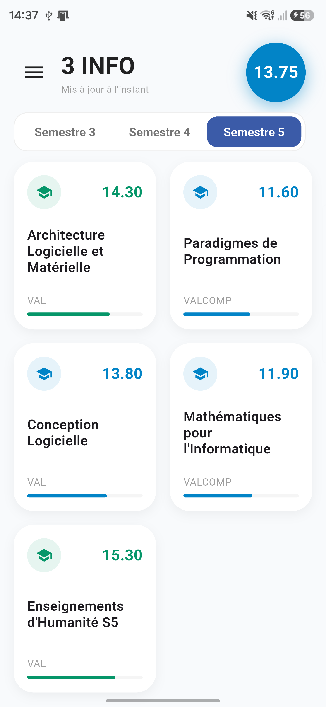
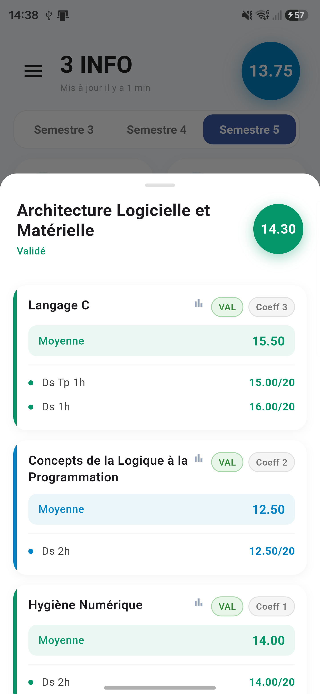
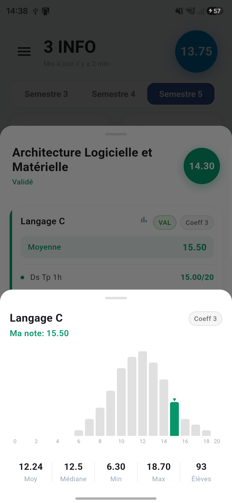

# Campus INSA

[](https://github.com/Aer-3888/Notes_insa/actions/workflows/release.yml)

Android app for INSA Rennes students: timetable, grades, weather and campus services in one place.

## Screenshots

<p align="center">
  
  
  
  
</p>

<p align="center"><sub>Semester dashboard, teaching unit detail, anonymous cohort comparison, and sign in. All grades shown are fictional sample data.</sub></p>

## Features

- Fetch grades via secure native library (inscore)
- Biometric authentication
- Background fetch with push notifications on grade changes
- QR code scanner for Google Authenticator migration (TOTP secret import)
- Offline access with encrypted local storage

## Requirements

- Flutter SDK `^3.10.4`
- Android SDK (minSdk 30)
- Node.js (for pre-commit hooks)

## Installation

```bash
# Install Flutter dependencies
flutter pub get

# Install JS tooling (husky + prettier)
npm install

# Run on device
flutter run
```

## Build

```bash
flutter build apk --release
```

## Project structure

```
lib/
  screens/       # UI screens
  components/    # Reusable widgets
  providers/     # Riverpod state management
  services/      # Native bridge, auth, notifications
  models.dart    # Data models
  data.dart      # JSON parser
android/
  app/lib/       # inscore.aar native grades library
```
