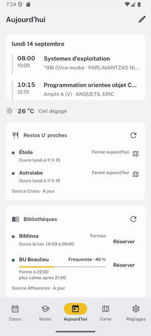
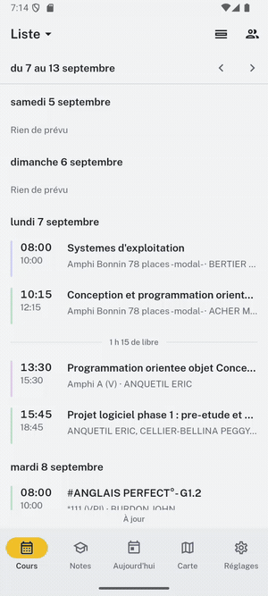
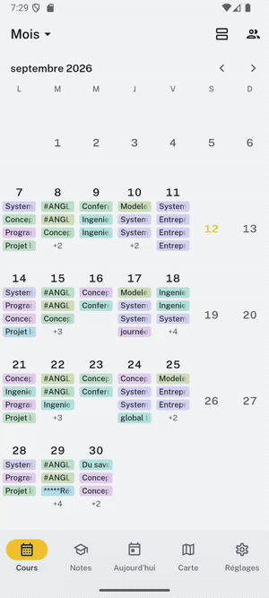
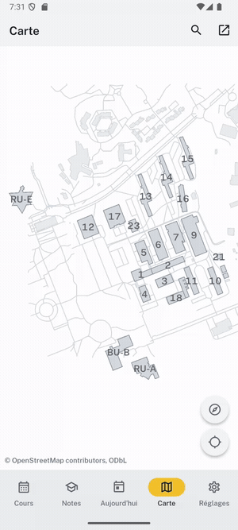
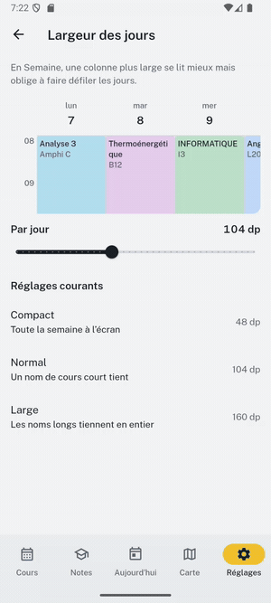
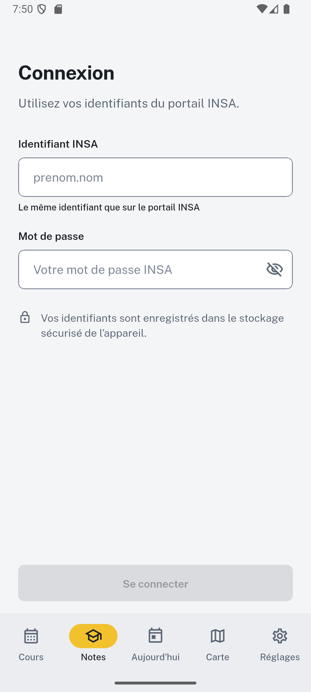

# Campus Hub

[](https://github.com/Aer-3888/Notes_insa/actions/workflows/release.yml)

Campus app for INSA Rennes students. Timetable, grades, campus map,
associations, library occupancy, laundry and weather in one place, and most of
it works offline.

## Download

Grab the latest APK from the
[**Releases page**](https://github.com/Aer-3888/Notes_insa/releases/latest) and
open it on your phone. Android 11 (API 30) or newer.

Android will warn that the file comes from outside the Play Store. Allow the
install for your browser or file manager when it asks; the APK is signed with
the same key for every release, so updates install over the top without
uninstalling first.

No account is needed for the timetable, the map, associations, the library, the
laundry or the weather. Only **Notes** asks for your INSA credentials, and they
go nowhere but INSA's own login server.

## Screenshots

<p align="center">
  
  
  
</p>

<p align="center"><sub>Aujourd'hui, the timetable in Liste and Semaine, and Mois with its classes shown or hidden.</sub></p>

<p align="center">
  
  
</p>

<p align="center"><sub>The campus map, and setting how wide a day is in Semaine.</sub></p>

<p align="center">
  
</p>

<p align="center"><sub>Notes asks for the portal login. The grades behind it are not pictured, because a screenshot of them would be somebody's real marks.</sub></p>

## What it does

- **Emploi du temps** reads your ADE group and shows it five ways: a
  continuous list across days, one day, three days, a week grid you can set the
  column width of, and a month whose cells carry the day's classes. Rooms are
  resolved to buildings on the campus map.
- **Notes** signs in through CAS, handles the 2FA code, and reads Mon Dossier
  Web: grades, averages and coefficients. Refreshes in the background and
  notifies you when a grade lands. You can opt in to see where you sit in your
  promo, which shares your subject averages anonymously.
- **Carte** locates buildings, amphis and services on the campus plan, and
  answers "where is this room".
- **Associations** is a directory of the 29 student associations with their
  events, and reminds you before one you follow.
- **Laverie** shows which washers and dryers are free.
- **Météo** gives the campus forecast.

The home screen is a hub of cards you can resize and reorder, each showing what
it has for you today: your next classes, how full the BU is with its booking
link, the CROUS menu, and the events of the associations you follow.

## Privacy

Your INSA credentials are stored encrypted on the device and are sent only to
INSA's own CAS server. Grades are cached locally, so the app opens instantly
and works without a connection.

Only one feature sends anything off the device, and it is off unless you turn
it on. The promo comparison shares your **subject averages, department,
semester and academic year** with the project's own server, with nothing that
identifies you: no name, no student number, no individual grade. You are asked
during onboarding and can decline, which costs you only that one screen.

There is no analytics SDK and no third-party tracking.

## Development

Requirements:

- Flutter, stable channel (built against 3.41)
- Dart SDK `^3.10.4`, which `pubspec.yaml` pins
- Android SDK, minSdk 30
- Node.js, for the husky hooks

```bash
flutter pub get
npm install

# APP_SECRET keys the local encrypted store; any value works for development.
flutter run --dart-define=APP_SECRET=dev
```

Checks, the same ones CI runs:

```bash
flutter analyze --fatal-infos
flutter test
cd android && ./gradlew testDebugUnitTest
```

## Releasing

Releases are cut by pushing a **tag**, not by pushing to `main`:

```bash
# bump version: in pubspec.yaml first, then
git tag v1.2.0
git push origin v1.2.0
```

Codeberg is the source of truth and mirrors to GitHub, where
`.github/workflows/release.yml` runs the checks, signs an APK and publishes it
against that tag. The tag has to originate on Codeberg: one created on GitHub
is pruned by the next mirror sync, and GitHub then demotes the release to an
untagged draft that nobody can download.

Tag names carry no build number, because GitHub cannot create a tag containing
`+`. The full `1.2.0+34` from `pubspec.yaml` becomes the release title.

Signing comes from repository secrets on GitHub: `KEYSTORE_BASE64`,
`KEY_STORE_PASSWORD`, `KEY_ALIAS`, `KEY_PASSWORD`, plus `APP_SECRET`. The Gradle
config refuses to assemble a CI release signed with debug keys, so a missing
secret fails the build rather than shipping an unsigned APK.

### iOS / TestFlight

The iOS build is performed on GitHub's `macos-14` runner, so a local Mac is not
needed. It is manually dispatched through **iOS TestFlight** until the first
signed build has been installed by the internal testers.

Create a protected `testflight` environment in GitHub and add `APP_SECRET`,
`IOS_DIST_CERT_P12_BASE64`, `IOS_DIST_CERT_PASSWORD`,
`IOS_PROVISION_PROFILE_BASE64`, `IOS_KEYCHAIN_PASSWORD`, `ASC_KEY_ID`,
`ASC_ISSUER_ID`, and `ASC_KEY_P8_BASE64`. The workflow reads the signing team
and profile identifier from the provisioning profile. Neither is committed.

The unsigned **iOS Verify** workflow runs the simulator build and native unit
tests. Until `ios/Podfile.lock` is committed, it attaches the generated lockfile
as the `ios-podfile-lock` artifact. Download and commit that artifact after the
first successful run. Subsequent iOS jobs install Pods in deployment mode.

In App Store Connect, register `com.aer.campus` as **Campus Hub**, create an
internal group named `Campus Hub (interne)`, and enable automatic distribution.
Once the first TestFlight build is confirmed, enable the commented `v*` tag
trigger in `.github/workflows/ios-release.yml` so iOS ships beside Android.

## Project structure

```
lib/
  main.dart          # entry point, theme and routing
  shell/             # campus hub, bottom bar, app settings
  modules/           # most of the app, one folder per module
    schedule/        #   ADE timetable, five views, ICS parsing
    grades/          #   CAS sign-in, Mon Dossier Web, cohort stats
    campus_map/      #   buildings, rooms, services
    associations/    #   directory, events, reminders
    library/         #   BU occupancy
    laundry/         #   washer and dryer availability
    crous/           #   restaurant menus
    weather/         #   campus forecast
  services/          # CAS client, Vaadin/MDW transport, notifications
  core/              # caching, freshness, time, navigation
  theme/             # tokens, colour schemes, shared state views
  providers/         # Riverpod providers shared across modules
  components/        # grades widgets not yet moved into the module
  screens/ utils/    # the TOTP import: QR scan, base32, pbkdf2
  protos/            # the Google Authenticator migration format
docs/design/         # design direction and review checklist (local only)
tool/                # capture and debugging scripts
```

## Data sources

ADE (timetable), CAS and Mon Dossier Web (grades), Affluences (library),
CROUS (restaurants), the INSA and AEIR sites (associations), and
OpenStreetMap under ODbL for the campus plan. The app reads what a browser
would read, and nothing is scraped that a student cannot see themselves.
